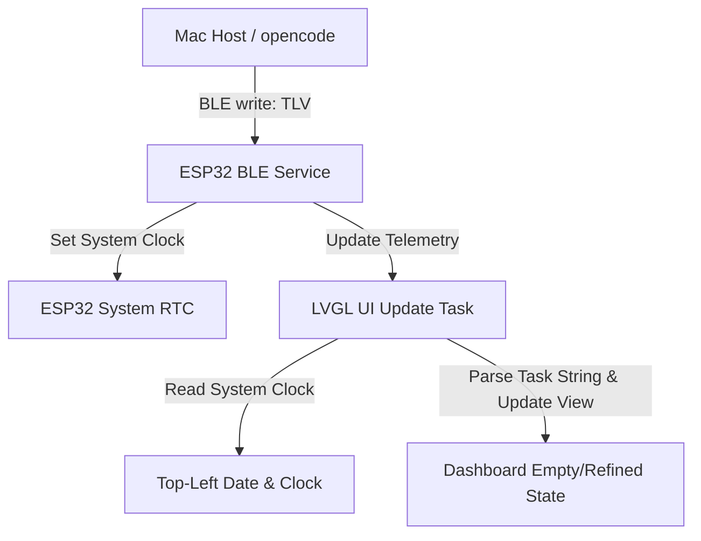

# Technical Design - Stitch UI Dashboards

This document outlines the technical architecture and data flows for implementing the Stitch-based UI mockups on the ESP32-C6 AI Monitor.



## 1. Data Contract & Communication

### 1.1 Extended Telemetry Buffers
In [main/ble_server.h](file:///Users/wangheng/workspace/pico/esp32-ai-monitor/main/ble_server.h), we will increase the size of `active_tool` from 128 to 256 bytes to hold up to three detailed task strings safely:
```c
char active_tool[256];
```

### 1.2 Delimiter-Based Task String Format & Safe Parsing
The active tasks will be serialized as a delimited string transmitted in the `active_tool` field:
- **Task Separator**: `|` (splits the string into individual tasks, max 3)
- **Field Separator**: `,` (splits a single task into its attributes)
- **Field Ordered List**: `Name,ID,Time,Status`
  - `Status` values: `working`, `done`, `paused`, `idle`

*Example payload:*
`"Model Training,99x-A,03:32,working|Data Indexing,102-B,01:15,done|Syncing Codex,044-C,00:42,paused"`

#### Safe Parsing Guidelines (Thread-Safety & Robustness)
- **Thread-Safety**: The BLE write callback writes to `s_telemetry` on the NimBLE task thread under `s_telemetry_mutex`. In `ui.c`, the UI task calls `ble_server_get_telemetry()` to copy the entire telemetry data structure to a local buffer before parsing it, eliminating concurrency race conditions on the string.
- **Robust Tokenization**: We will use `strtok_r` (the reentrant, thread-safe version of `strtok`) to tokenize the task strings safely.
- **Null Guards**: The parser will check for `NULL` returns on every single token. If a token is truncated or fields are missing, the parser will fallback gracefully:
  - `Name`: fallback to `"Unknown Task"`
  - `ID`: fallback to `"---"`
  - `Time`: fallback to `"00:00"`
  - `Status`: fallback to `"idle"`

### 1.3 Automatic Time Synchronization & Timezone Parity
To support hosts connecting from any timezone in the world without requiring complex timezone parsing or environment config on the ESP32:
- **Host-Side Local Epoch**: The host client (`mac_host.py`) will calculate the local date/time of the Mac as a local Unix epoch (i.e., local time as if it were UTC):
  ```python
  import datetime
  now = datetime.datetime.now()
  local_epoch = int(now.replace(tzinfo=datetime.timezone.utc).timestamp())
  ```
  This `local_epoch` will be sent via the `TYPE_SYNC_TIME` (Type `0x07`) BLE write.
- **ESP32 RTC Sync**: [main/ble_server.c](file:///Users/wangheng/workspace/pico/esp32-ai-monitor/main/ble_server.c) sets the RTC system clock to this local representation epoch:
  ```c
  struct timeval tv = {
      .tv_sec = s_telemetry.sync_time,
      .tv_usec = 0
  };
  settimeofday(&tv, NULL);
  ```
  Since the RTC is set directly to the host's local representation, the standard library `localtime()` call (which defaults to UTC) on the ESP32 will output the host's exact local time (weekday, date, hour, minute, second) automatically. No timezone environment configuration (`setenv("TZ")`) is needed on the firmware.

## 2. UI Layout & Custom Components (LVGL v9)

### 2.1 Color Tokens & Harmonization
We will map the new Stitch visual colors to the existing telemetry states:
- **Background**: `#000000` (OLED Pure Black)
- **Nexus Orange (Accent)**: `#FF4500` (replaces `COLOR_AMBER` / `COLOR_RED` for status containers, titles, and highlight pills)
- **Nexus Blue (Secondary)**: `#00F0FF` (replaces `COLOR_CYAN` for active spinner, progress indicators, and edge progress)
- **Gray Text**: `#9CA3AF`

### 2.2 Time & Date Header (Common Component)
To keep the dashboard consistent across all states, the Time & Date Header is rendered on **all screens** (including `guide_screen` (waiting), `dashboard_screen` (idle/working), and `approval_screen` (confirm)):
- **Date**: A label showing the current formatted weekday + day (e.g. `Tuesday 17`) in Montserrat-18.
- **Clock**: A label displaying the hours and minutes (e.g. `10:40`) in Montserrat-48.
- **Seconds**: A label displaying the seconds (e.g. `45`) in Montserrat-24, aligned vertically next to the clock.
- **System Timer**: A 1-second LVGL timer calls `localtime()` and updates the labels dynamically. If `sync_time` is not yet received, it displays placeholder dashes (`--:--` and `--`).

### 2.3 Dashboard State Switcher
The dashboard screen will host a main container that switches layout states dynamically (by toggling visibility flags on statically pre-allocated widgets to prevent heap fragmentation):
- **State: BLE_STATE_IDLE** (Empty State):
  - Hide the active task list container (`lv_obj_add_flag(task_container, LV_OBJ_FLAG_HIDDEN)`).
  - Show the empty state card (`lv_obj_remove_flag(empty_card, LV_OBJ_FLAG_HIDDEN)`).
  - Display "No Active Tasks" with `task_alt` icon in the orange container.
- **State: BLE_STATE_WORKING** (Refined State):
  - Hide the empty state card.
  - Show the active task list container.
  - Parse the `active_tool` string into up to 3 task rows.
  - For each active task:
    - Update Name, ID, Time labels.
    - Set the status icon: check icon for `done`, pause icon for `paused`, and a cycling character animation (e.g., `|`, `/`, `-`, `\`) for `working` to avoid the overhead of heavy LVGL spinner widgets.
    - Make the row visible.
  - For remaining empty task slots (e.g., if only 1 task is running):
    - Hide the slot container to prevent displaying stale data.

### 2.4 Edge Progress & Footer
- **Edge Progress**: Draw a thin rectangular bezel with rounded corners (`12px` offset) and a partial progress indicator using the current `progress_current` value (Codex progress) to match the mockup.
- **Footer**:
  - Bottom-Left: Large thin digits showing the progress value (e.g., `85%`) in Montserrat-48.
  - Bottom-Right: A small orange rounded container containing the timestamp of the last telemetry update (e.g., `07/22 09:37`).

## 3. Alternative/Trade-offs & System Dependencies

### 3.1 Kconfig Font Configurations
To support the large clock and footer percentage displays, we require `Montserrat-48` to be compiled into the flash binary.
- **Prerequisite Flag**: `CONFIG_LV_FONT_MONTSERRAT_48=y` must be appended to `sdkconfig.defaults`.
- **Reference Guard**: Guard the compilation and usage in `ui.c` via standard declarations:
  ```c
  #if CONFIG_LV_FONT_MONTSERRAT_48
  extern const lv_font_t lv_font_montserrat_48;
  #else
  #define lv_font_montserrat_48 lv_font_montserrat_24 // Fallback if font is missing
  #endif
  ```

### 3.2 Font Storage Trade-offs
We chose to use the built-in Montserrat fonts (Montserrat-14, 18, 24, and Montserrat-48) to avoid having to compile and store custom TrueType/OpenType font files on the ESP32 flash chip, saving valuable memory and minimizing compile-time assets.
